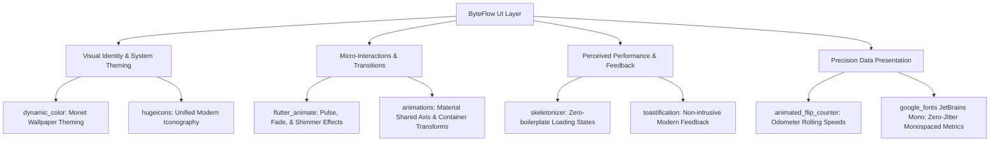

# UI & UX Design Library Evaluation & Integration Roadmap for ByteFlow

## Goal Description

ByteFlow is a modern, battery-efficient Android network monitoring application built with Flutter and Kotlin. It tracks real-time socket throughput, historical data consumption, per-app network utilization, SIM data plans, and status-bar notifications. 

The goal of this plan is to evaluate the Flutter UI/UX ecosystem against ByteFlow's specific technical and visual requirements, determine the optimal UI/UX design libraries, and outline a step-by-step roadmap for elevating ByteFlow into a top-tier Android utility with fluid animations, dynamic theming, and crisp data presentation.

---

## Architectural Context & Requirements

ByteFlow has distinct characteristics that define its UI/UX requirements:

1. **High-Frequency 1 Hz Reactive Updates**:
   - The dashboard speed card re-renders throughput numbers every second. Numerical layout shifting and abrupt digit flashing must be eliminated using tabular monospaced numbers and mechanical rolling animations.
2. **Android-First System Utility Experience**:
   - Must adhere to Material 3 / Material You guidelines. Users on Android 12+ expect the app palette to harmonize dynamically with their system wallpaper (`dynamic_color`).
3. **Heavy Data Analytics & Complex Hierarchy**:
   - Includes real-time line charts, bar graphs, multi-SIM cards, per-app breakdown lists, and permissions status indicators.
4. **Zero Battery Overhead & High Frame Rate (60/120 Hz)**:
   - UI libraries must have zero background overhead, lightweight memory footprint, and full tree-shaking support.

---

## Comprehensive Library Evaluation & Matrix

### Evaluation Matrix

| Category | Candidate Libraries | Status / Version | Architectural Fit for ByteFlow | Recommendation |
| :--- | :--- | :--- | :--- | :--- |
| **Theme & Material You** | `dynamic_color` | `^2.1.0` (Google/Material) | **Essential**. Extracts wallpaper Monet palette on Android 12+ with graceful fallback. | **Adopt** |
| | `flex_color_scheme` | `^8.1.0` | High-quality M3 color engine with predefined themes and harmonized surface tones. | **Adopt (Optional/Paired)** |
| **Motion & Micro-interactions** | `flutter_animate` | `^4.5.2` (gskinner) | **Essential**. Declarative chaining for entrance animations, live indicator pulses, and badge transitions. | **Adopt** |
| | `animations` | `^2.0.11` (Flutter team) | Material Motion transitions (Container Transform, Shared Axis) for page/sheet navigation. | **Adopt** |
| **Numerical Transitions** | `animated_flip_counter` | `^0.3.4` | **Essential**. Converts abrupt 1 Hz speed jumps into smooth vertical odometer rolls. | **Adopt** |
| **Loading & Perceived Performance**| `skeletonizer` | `^2.1.3` | **Essential**. Declaratively transforms existing App Tiles and Summary Cards into shimmer skeletons during IO queries. | **Adopt** |
| | `shimmer` | `^3.0.0` | Requires manual skeleton layout mocks; high maintenance overhead compared to Skeletonizer. | Skip |
| **Iconography** | `hugeicons` | `^1.1.7` | **Essential**. 4,700+ modern stroke-rounded icons with sharp line weights, duotone styles, and tree-shaking. | **Adopt** |
| | `phosphor_flutter` | `^2.1.0` | Flexible multi-weight icon system (duotone, bold, fill). Strong alternative to Hugeicons. | Alternative |
| **Typography** | `google_fonts` | `^8.2.1` (Flutter team) | **Essential**. Tabular figures (JetBrains Mono / Space Grotesk) eliminate speed-text width jitter. | **Adopt** |
| **Notification & Alerts** | `toastification` | `^3.0.0` | Modern floating toast notification pills with swipe-to-dismiss and progress timers. | **Adopt** |
| **All-in-One Component Kits** | `shadcn_ui` / `forui` | `^0.56.3` / `^0.26.0` | Geared toward web/desktop minimalism. Clashes with Android M3 system navigation and Monet dynamic coloring. | Skip for core UI |
| | `getwidget` | `^4.0.0` | Heavy, based on legacy Material 2; lacks modern Material 3 styling. | Skip |

---

## The Recommended "ByteFlow Velocity" UI/UX Stack

Rather than adopting a rigid monolithic component kit that conflicts with Android's platform identity, the optimal approach is a **Modular Material You + Micro-Motion Design Stack**:



### Detailed Component Roles:

1. **`dynamic_color`**: Integrates ByteFlow directly into Android 12+ wallpaper color extraction, making ByteFlow feel like a built-in Google Pixel / Samsung OneUI system tool.
2. **`animated_flip_counter`**: Eliminates abrupt number flashing on the 1 Hz speed card by smoothly sliding each digit vertically.
3. **`google_fonts` (JetBrains Mono / Inter)**: Provides fixed-width numerical glyphs for `totalVal`, `rxVal`, and `txVal`, ensuring surrounding layout elements never shift when numbers change.
4. **`skeletonizer`**: Wraps the per-app usage list while Kotlin coroutines read Android's `NetworkStatsManager`, replacing the spinner with realistic shimmer skeletons.
5. **`flutter_animate`**: Adds a gentle breathing pulse to the green "1 Hz" live dot and staggered entrance transitions when switching navigation tabs.
6. **`hugeicons`**: Replaces generic Material icons with modern stroke-rounded network, SIM, speed, and hardware glyphs.

---

## User Review Required

> [!IMPORTANT]
> **Decision on Dynamic Color & Offline Fonts**:
> 1. `dynamic_color` extracts Monet colors on Android 12+. On older Android versions (API 26-31), it automatically falls back to ByteFlow's configured seed palette (`0xFF1E88E5`).
> 2. For `google_fonts`, fonts can be cached locally or bundled as assets in `pubspec.yaml` to ensure ByteFlow remains 100% functional offline with zero external network calls.
>
> Please confirm if you approve bundling the fonts for offline privacy and adopting this modular design stack.

---

## Open Questions

> [!NOTE]
> 1. **Icon Library Preference**: Do you prefer **Hugeicons** (4,700+ modern rounded stroke icons) or **Phosphor Icons** (6 weights from Thin to Duotone)? Hugeicons is proposed by default.
> 2. **Toast Style**: Do you prefer migrating all transient feedback (`SnackBar`) to floating pill toasts via **Toastification**, or keeping standard floating Material 3 SnackBars?

---

## Proposed Changes

### Dependencies (`pubspec.yaml`)

#### [MODIFY] [pubspec.yaml](file:///data/data/com.termux/files/home/byteflow/pubspec.yaml)
- Add UI/UX libraries to `dependencies`:
  - `dynamic_color: ^2.1.0`
  - `animated_flip_counter: ^0.3.4`
  - `skeletonizer: ^2.1.3`
  - `flutter_animate: ^4.5.2`
  - `hugeicons: ^1.1.7`
  - `google_fonts: ^8.2.1`
  - `toastification: ^3.0.0`

---

### Theme & Typography Enhancement

#### [MODIFY] [theme.dart](file:///data/data/com.termux/files/home/byteflow/lib/app/theme.dart)
- Update `AppTheme` to support dynamic `ColorScheme` injection from `dynamic_color`.
- Configure `TextTheme` with `google_fonts` (e.g. `Inter` for UI typography, `JetBrains Mono` for tabular metrics).
- Add custom `ThemeExtension` for network transfer states (RX green, TX blue, warning/critical thresholds).

```dart
// Example: Dynamic Theme builder integration
DynamicColorBuilder(
  builder: (ColorScheme? lightDynamic, ColorScheme? darkDynamic) {
    return MaterialApp.router(
      theme: AppTheme.buildLightTheme(lightDynamic),
      darkTheme: AppTheme.buildDarkTheme(darkDynamic),
      routerConfig: router,
    );
  },
);
```

---

### Dashboard Speed Card Modernization

#### [MODIFY] [speed_card.dart](file:///data/data/com.termux/files/home/byteflow/lib/widgets/speed_card.dart)
- Replace static `Text(totalVal)` with `AnimatedFlipCounter` wrapped in `JetBrainsMono` typography.
- Add `flutter_animate` pulsing effect to the live 1 Hz indicator dot.
- Replace stock icons with modern `Hugeicons` network speed glyphs.

```dart
// Prototype: Rolling Odometer Speed Metric
AnimatedFlipCounter(
  value: speedValue,
  fractionDigits: 1,
  textStyle: GoogleFonts.jetbrainsMono(
    fontSize: 48,
    fontWeight: FontWeight.bold,
    color: theme.colorScheme.onPrimaryContainer,
  ),
);
```

---

### App Usage Screen Skeleton Loading

#### [MODIFY] [apps_screen.dart](file:///data/data/com.termux/files/home/byteflow/lib/screens/apps/apps_screen.dart)
- Wrap the list content in `Skeletonizer(enabled: state.isLoading)` using dummy data while Kotlin coroutines query `NetworkStatsManager`.
- Eliminate the abrupt jump from `CircularProgressIndicator` to populated list.

---

## Verification Plan

### Automated Tests & Static Analysis
- Run `dart analyze` to ensure 0 lint warnings and full type compliance with Dart 3.12:
  ```bash
  dart analyze
  ```
- Run unit tests to verify existing models and DAOs are unaffected:
  ```bash
  dart test test/unit/
  ```

### Manual Verification
1. **Dynamic Color Harmonization**:
   - Verify on Android 12+ that system wallpaper theme applies across app bars, cards, and navigation surfaces.
   - Verify fallback seed color displays correctly when dynamic color is unavailable.
2. **Speed Card Dynamics**:
   - Generate active network traffic and verify the numbers flip smoothly without widget jumping or stutter.
   - Verify live 1 Hz indicator pulses subtly.
3. **App Usage Skeleton**:
   - Trigger a refresh on the Apps tab and verify shimmering placeholder tiles display cleanly before real app stats populate.
